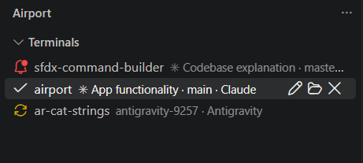
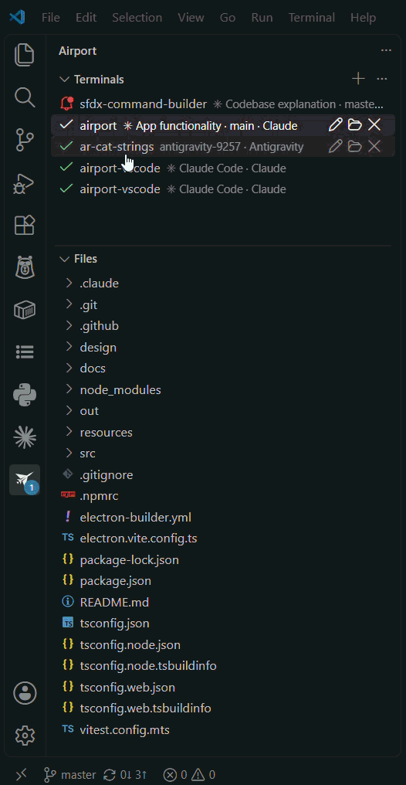
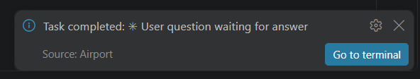

# ✈️ Airport

Run Claude Code, Codex, Devin, and other AI coding agents side by side — in VS Code's own
terminals — and see at a glance which ones need you.

If you juggle several AI agent terminals at once, you know the problems:

- **They're all just terminal tabs.** You end up alt-tabbing between them to check whether one is
  still thinking or has been sitting idle waiting for an answer for the last five minutes.
- **You can't tell what an agent is touching.** Once you're in a terminal, there's no easy way to
  see which files it's actually working on — just a separate file explorer or `cd` history to
  piece it together.

Airport fixes both: a sidebar tracks every terminal's status so you only switch to the ones that
need you, and a Files view always shows the workspace the selected terminal's agent is operating
on.

## What it does

- **A dedicated sidebar** lists all your agent terminals in one place, each with a live status
  light.
- **Start any agent** — Claude Code, Codex, Antigravity, Devin, or a plain shell — in one click,
  each running in a real VS Code terminal.
- **Know who needs you** without checking every tab: terminals are color-coded so a blocked one
  stands out immediately.
- **Browse each terminal's files** in a lightweight panel that follows whichever terminal is
  selected, without touching your workspace folders — letting you open multiple workspaces inside
  a single VS Code window.
- **Pick up where you left off** — Airport offers to resume your previous terminals the next time
  you open the workspace.

## Terminal Status

| | Status | Meaning |
|---|---|---|
|  | **Needs you** | The agent is blocked on a question or a permission prompt |
|  | **Working** | The agent is thinking or running a tool |
|  | **Done** | The agent finished its turn and is idle |

## Getting started

1. Install the extension and open the **Airport** icon in the Activity Bar.
2. Click **+** in the Terminals view and pick an agent to start.

   
3. Work as usual in the terminal that opens — Airport watches its output in the background and
   updates the status for you.
4. Click any terminal in the sidebar to jump straight to it, or use the **Files** view
   underneath to browse its folder without leaving the sidebar.

   

Notifications can be turned on so you get an OS notification when a terminal needs you — toggle
them from the Terminals view's toolbar or the Command Palette (**Airport: Turn On/Off
Notifications**).

## Requirements

- VS Code 1.93 or newer.
- A shell with [shell integration](https://code.visualstudio.com/docs/terminal/shell-integration)
  support — bash, zsh, fish, pwsh, and cmd all work. If shell integration doesn't activate for your
  shell, the terminal still runs, it just won't show a status light.
- The AI coding agent(s) you want to run (Claude Code, Codex, etc.) already installed and working
  from your regular terminal.

## Known limitations

- No built-in diff viewer — use VS Code's Source Control view for that (works when a terminal's
  folder is also a workspace folder).
- A terminal's VS Code tab name can't be changed after it's created, due to a VS Code API
  limitation; renaming a terminal in the sidebar keeps working, it just doesn't rename the
  underlying tab.
- After reloading the window, resumed terminals won't show a status until they produce new output.

## About

Airport is a VS Code port of the [Airport desktop app](https://github.com/vignaesh01/airport),
rebuilt to run entirely inside VS Code's own terminals instead of a separate Electron window — so
there's nothing to install beyond the extension itself, and it works the same over SSH, WSL, and
GitHub Codespaces.
